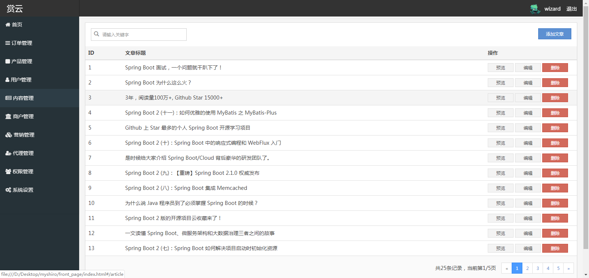
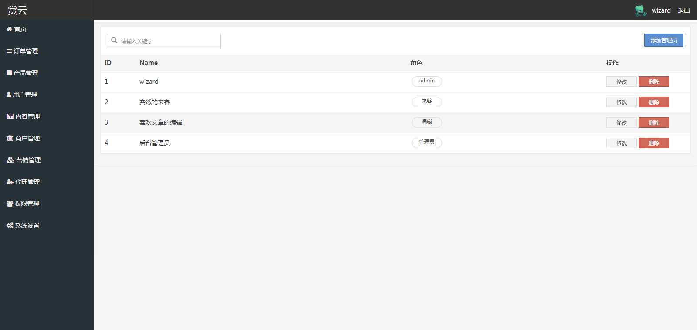
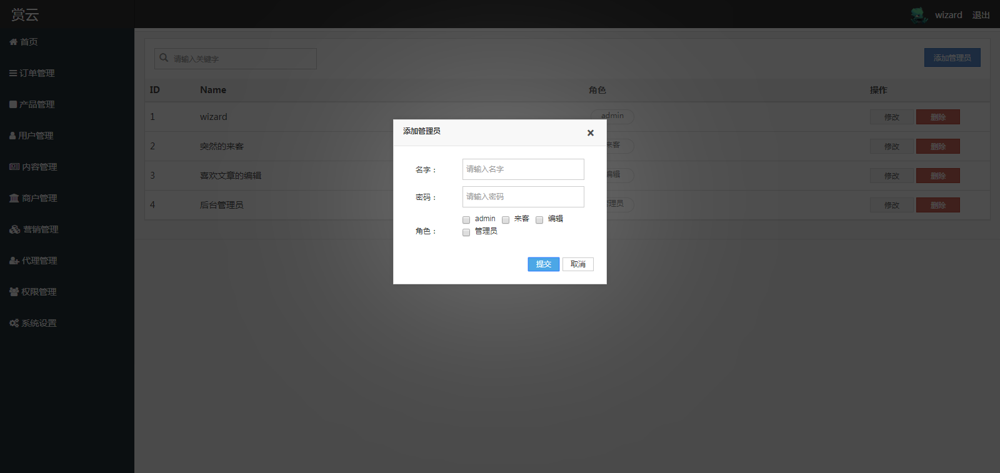
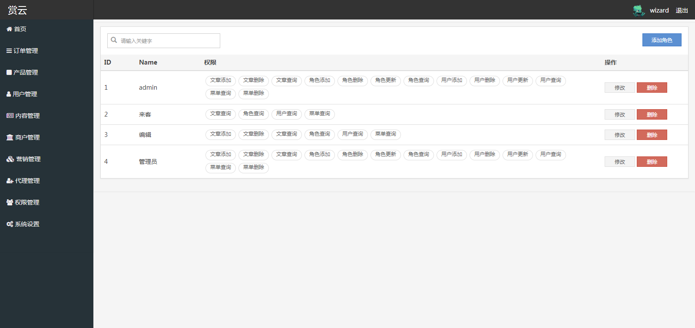
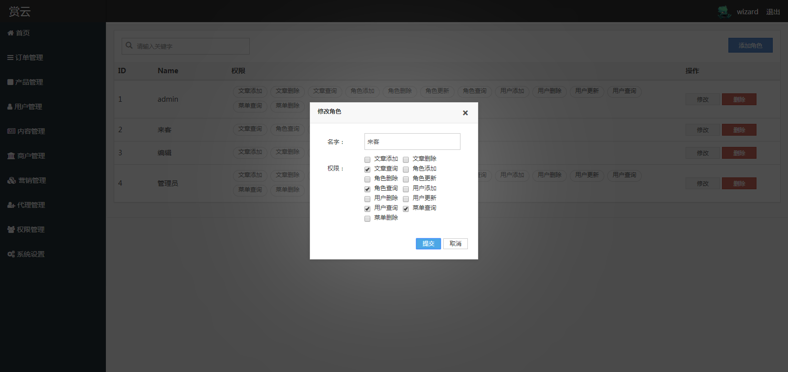
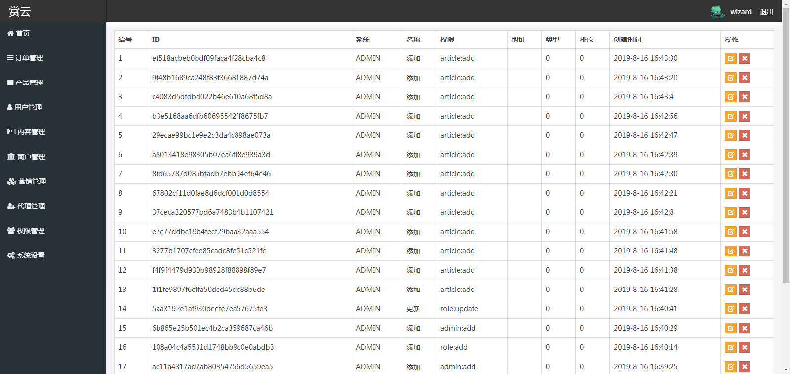

# 赏云

### 类型
> ***权限管理系统***

### 技术栈
> 1. 后端: SpringBoot + Shiro + Mybatis
> 4. 前端: Vue
> 2. 数据库： mysql
> 3. 服务器: tomcat

### 描述
这是一个后台管理系统，采用了Shiro分别对用户-角色-权限进行管理；采用了前后端分离技术，后端提供接口，前端访问接口获取json数据；采用了Mybatis作为持久层。

### 展示
* 后端接口地址: http://localhost:8080
* 首页: front_page/index.html

### 项目部署
1.项目配置
    * [MySQL](https://dev.mysql.com/downloads/mysql/)
    * [JDK1.8或以上](http://www.oracle.com/technetwork/java/javase/overview/index.html)
    * [Maven](https://maven.apache.org/download.cgi)
2. 编辑 application.properties 文件，修改要连接的数据库用户名密码
   ```
   spring.datasource.username=root
   spring.datasource.password=root
   ```
3. 创建数据库
   ```
   create database permission_manager;
   ```
4. 选择使用数据库
   ```
   use blog;
   ```
5. 数据库导入myblog-master/sql下的数据库文件
   * db.sql
   
### 项目截图







### 联系交流
- EMail: [carl36528@gmail.com](http://carl36528@gmail.com)
- 我的网址: [itmewdata.com](https://itnewdata.com)
